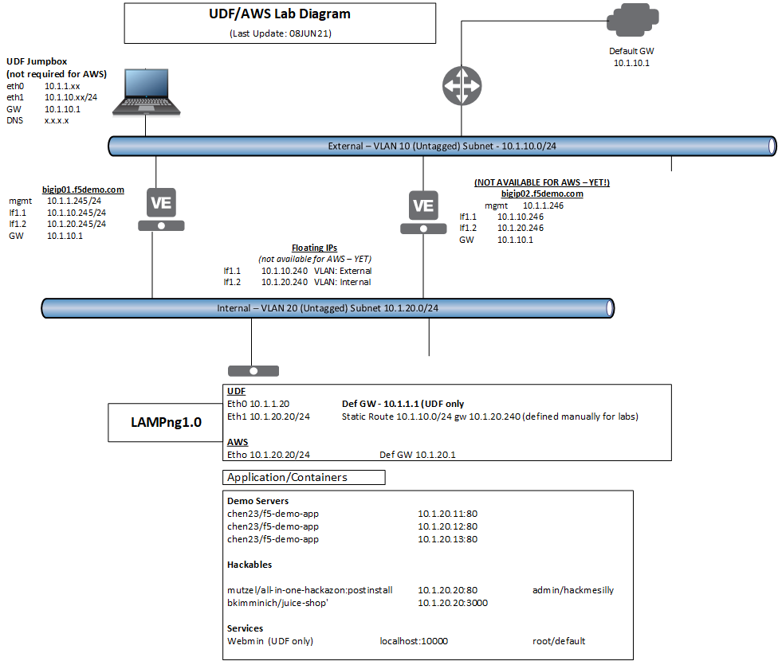

F5 BIG-IP Labs on AWS
=====================

Introduction
------------
This directory contains a AWS Cloud Formation Template (CFT) designed to build out a BIG-IP labs that can be used to learn about various F5 solutions.

It is in it's infancy, definitely a work in progress. That includes this readme.

Some things to know when using the the **f5-aws-bigip-labs-vX.x** CFT template.  It is based off the 3nic PAYG learning stack found here: https://github.com/F5Networks/f5-aws-cloudformation/tree/master/experimental/standalone/3nic/learning-stack/payg

A big difference is the IP addressing is standardized (as much as possible) around the F5 Unified Demo Framework (UDF) lab environment.  The other difference is that the BIG-IP can be brougt up unconfigured, except for set up, with only base networking configured, or, using the AS3 json scripts provide with networking and preconfigure virtual servers and pools.

I will probably not explain everything you need to know, especially if you haven't used AWS much, but I will give you the basics of using the template.

1. Clone the respository to your device
1. Go to cloud formation in your AWS console and **f5-aws-bigip-labs-vX.x** template.
1. Most of the template is self explanatory or can be defaulted.
   1. Enter a stack name.
   2. Under **Networking Configuration** select an AZ.  Only **east** AZs are available at this time.
   3. You can default until **SSH Key**.  Select your SSH key pair you want to use.
   4. Source Address(es) for manager and web application access. Enter your source IP for to restrict lab access.  When in doubt you can just enter **0.0.0.0/0** and open it up.
   5. Again you can default until **BIG-IP Base Networking and Virtual Service Configuration** here is where you will tell the BIG-IP how you want your lab set up.
      1. If you leave the defaults the BIG-IP will basically be a blank slate.  Yours to configure however you want.
      2. If you select **Yes** under **configBigipNet** the BIG-IP will be configured with the base networking for the labs (vlans, self IPs, gateway)
      3. Under **AS3 Declaration URL** you can enter a link to the json that will configure virtual services (pools, virtual servers, etc). 
      1. In github you do the by clicking on the AS3 json file you want, then click on the **Raw** button to the right and copy and paste the URL into the box.

..IMPORTANT::

If you enter an AS3 URL make sure **configBigipNet** is set to **Yes** or you will end up with no configuration on the BIG-IP.
   

A basic diagram of the network is provide here, there is NO second BIG-IP at this time.
   

